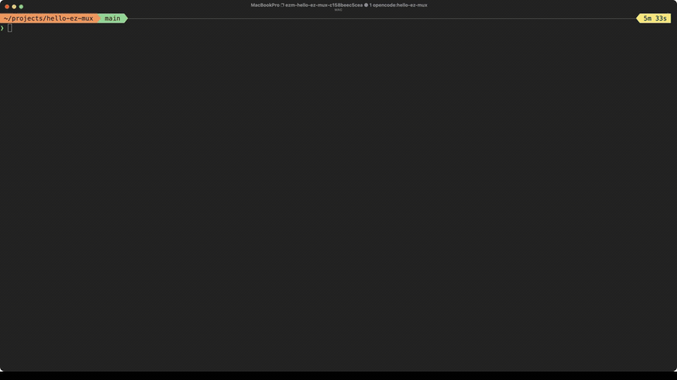

# ez-mux



`ez-mux` (`ezm`) turns a Git working tree into a deterministic tmux workspace for multitasking across worktrees and agent tools. It is an opinionated runtime layer rather than a layout-only session file: slots have stable identities, modes can be changed in place, and project-local runtime settings stay with the project session.

## Highlights

- Stable five-slot identity (`1..5`) with deterministic worktree assignment.
- Slot modes for `agent`, `shell`, `neovim`, and `lazygit`.
- Focus, swap-to-center, popup shell, layout presets, and repair actions through tmux keybinds.
- Optional `perles` auxiliary window for work tracking.
- Optional SSH-backed remote routing with path remapping; `mosh` and `tssh` can be selected per project.
- Optional OpenCode shared-server attach for agent mode.

The product is aimed at workflows where several agents or tools need to remain available at once. If all you need is “start this layout from config”, a simpler session manager such as tmuxinator may be a better fit.

> The recording above is a real, sanitized demonstration of the current `ezm` binary running against a temporary Git project on an isolated tmux server.

## Install

### Release archive

The [latest GitHub release](https://github.com/shanebishop1/ez-mux/releases/latest) is `v0.2.31`. Release archives currently cover these platforms:

| Platform | Archive |
| --- | --- |
| Linux x86-64 | `ezm-v0.2.31-linux-x64.tar.gz` |
| Linux arm64 | `ezm-v0.2.31-linux-arm64.tar.gz` |
| macOS x86-64 | `ezm-v0.2.31-macos-x64.tar.gz` |
| macOS arm64 | `ezm-v0.2.31-macos-arm64.tar.gz` |

Download the archive for the host from the [v0.2.31 release](https://github.com/shanebishop1/ez-mux/releases/tag/v0.2.31), then install the binary:

```bash
tar -xzf ezm-v0.2.31-<platform>.tar.gz
mkdir -p ~/.local/bin
install -m 755 ezm ~/.local/bin/ezm
```

Add `~/.local/bin` to `PATH` if necessary. The release also includes a checksum file; verify it with `sha256sum --check` on Linux or `shasum -a 256 --check` on macOS.

### npm

The `ez-mux` package is published. It includes the same Linux and macOS native binaries and requires Node.js 18 or newer for its launcher:

```bash
npm install --global ez-mux
```

`tmux` is still required at runtime; npm is only an installation channel.

### Build from source

With Rust 1.85 or newer:

```bash
cargo build --release --locked --bin ezm
mkdir -p ~/.local/bin
install -m 755 target/release/ezm ~/.local/bin/ezm
```

## Requirements and optional integrations

Supported host operating systems are Linux and macOS. The tested tmux feature floor is **tmux 3.2 or newer**: the popup workflow depends on `display-popup`, introduced in tmux 3.2. The repository's CI records the tmux version supplied by each Linux/macOS runner; it does not currently pin a separate lower-bound runner job.

### Required for the normal workflow

| Dependency | Why it is required | If unavailable |
| --- | --- | --- |
| `tmux` 3.2+ | Creates the project session, panes, keybinds, popups, and mode backing panes. | Startup cannot create or attach the workspace. |
| A login-capable shell | Pane and remote wrappers use `$SHELL -l`, falling back to `/bin/sh -l`. | Pane launches and remote fallback shells fail if the selected shell cannot run. |
| Git | Default startup calls `git worktree list --porcelain` to discover slot worktrees. | The default multi-worktree workflow warns and falls back to the current directory. Use `--no-worktrees` when Git is intentionally unavailable. |

`ezm` must also be run from a directory it can canonicalize. Git worktrees are the intended project input, but `--no-worktrees` deliberately reuses the current directory for every slot.

### Optional tools and integrations

| Tool or integration | Used for | Missing-tool behavior |
| --- | --- | --- |
| OpenCode | Default `agent` mode and shared-server attach. | Agent startup skips OpenCode and leaves a login shell. A failed attach is reported and also falls back to a shell. |
| `agent_command` integrations (Codex, Claude Code, or another CLI) | Replaces the default agent command. | `ezm` executes the configured command as written; its shell semantics determine failure or fallback. |
| `perles` | The auxiliary work-tracking window. | A missing local executable skips that window. A missing remote executable prints a warning and leaves the remote shell available. |
| `neovim` / `nvim` | `neovim` slot mode. | The mode tool is skipped when absent and the slot returns to a login shell; a non-zero tool exit is reported. |
| `lazygit` | `lazygit` slot mode. | A missing or failed invocation returns to a login shell; a non-zero exit is reported. |
| `ssh` | Default transport when remote routing is active. | Remote launch reports the transport failure and falls back to a local login shell; the remote operation is unavailable. |
| `mosh` | Remote transport when `ezm_use_mosh` is enabled. | The selected remote launch reports failure and falls back to a local login shell. |
| `tssh` | Remote transport when `ezm_use_tssh` is enabled. | The selected remote launch reports failure and falls back to a local login shell. |

`mosh` and `tssh` are not needed for local sessions. If both switches are enabled, `tssh` takes precedence. SSH credentials, keys, and host configuration remain the responsibility of the transport tool.

## Quick start

From the project directory:

```bash
ezm
```

The first run creates a session named like `ezm-<project>-<hash>`, bootstraps the requested slots (five by default), assigns discovered worktrees, installs runtime keybinds, and attaches to the session. A later run reattaches to that project session.

OpenCode is not required for startup. Without `opencode`, populated agent slots become login shells until an agent tool is installed or `agent_command` is configured.

Useful variants:

```bash
ezm --panes 3              # start with three visible slots
ezm --no-worktrees         # reuse the current directory in every slot
ezm preset --preset three-pane
ezm repair
ezm logs open-latest
ezm --help
```

### Reproducible interaction walkthrough

This sequence demonstrates launch, focus, mode switching, and reduced-layout toggling without claiming a particular terminal rendering:

```text
cd /path/to/project
ezm --panes 3
prefix f 2       # enter focus table, then choose slot 2
prefix S          # switch the focused slot to shell mode
prefix M-3        # toggle the three-pane preset
prefix P          # open or close that slot's popup shell
```

`prefix` means the tmux prefix key, normally `C-b`. `prefix N` and `prefix G` select the optional Neovim and Lazygit modes.

## Keybinds

| Key | Action |
| --- | --- |
| `prefix f` then `1..5` | Move the selected slot pane to the main focus position and focus it |
| `prefix u` | Toggle the current slot between `agent` and `shell` |
| `prefix a` | Set the current slot to `agent` mode |
| `prefix S` | Set the current slot to `shell` mode |
| `prefix N` | Set the current slot to `neovim` mode |
| `prefix G` | Set the current slot to `lazygit` mode |
| `prefix P` | Toggle the slot popup shell |
| `prefix d` | Detach, or hard-close when inside a popup context |
| `prefix h/j/k/l` | Pane navigation with slot-aware border refresh |
| `prefix M-3` | Toggle the `three-pane` preset |

## Configuration

The file name is `ez-mux.toml`. Config **path** selection is:

1. `EZM_CONFIG`, when non-empty (explicit path override).
2. `./ez-mux.toml`, when it exists in the current directory.
3. The OS default path:
   - Linux: `$XDG_CONFIG_HOME/ez-mux/ez-mux.toml`, otherwise `~/.config/ez-mux/ez-mux.toml`.
   - macOS: `~/Library/Application Support/ez-mux/ez-mux.toml`.

For settings that have environment variables, value precedence is **environment > config file > built-in default**. Empty values are treated as unset. The startup pane count is the exception: **`--panes` (or the positional `1..5` shortcut) > `panes` in the file > `5`**.

Environment-overridable settings are:

- `EZM_REMOTE_PATH` and `EZM_REMOTE_SERVER_URL`.
- `EZM_USE_TSSH` and `EZM_USE_MOSH` (`1`, `true`, `yes`, and `on` enable a switch; `0`, `false`, `no`, and `off` disable it; other non-empty values enable it).
- `PERLES_DIR` / legacy `BEADS_DIR`, and `PERLES_DB` / legacy `BEADS_DB`.
- `OPENCODE_SERVER_URL` and `OPENCODE_SERVER_PASSWORD`, overriding the file keys `opencode_server_url` and `opencode_server_password`.

`agent_command`, `opencode_slot_themes_enabled`, and `[opencode_slot_themes]` are file settings. `EZM_BIN` is an internal integration-wrapper override, not a general runtime setting.

The exported library convenience APIs `ensure_current_project_session()` and `ensure_project_session()` retain their shipped compatibility contract and read `EZM_REMOTE_PATH`, `EZM_REMOTE_SERVER_URL`, `EZM_USE_TSSH`, and `EZM_USE_MOSH` from the process environment. They do not load the CLI config file; applications that already resolve configuration should pass the resolved runtime context API instead. The CLI itself has one authoritative `environment > config file > default` resolution path.

Example without credentials:

```toml
panes = 5

# Optional remote routing; both values are required to activate it.
ezm_remote_path = "/srv/remotes"
ezm_remote_server_url = "https://remote.example:7443"
ezm_use_tssh = false
ezm_use_mosh = false

# Optional work-tracking locations.
perles_dir = ".perles"
perles_db = "/path/to/perles.db"

# Optional shared OpenCode server, used by the attach flow when remote routing is active.
opencode_server_url = "http://127.0.0.1:4096"

# This is executable shell code; see the trust boundary below.
agent_command = 'exec codex || exec "${SHELL:-/bin/sh}" -l'

opencode_slot_themes_enabled = true
[opencode_slot_themes]
"1" = "nightowl"
"2" = "orng"
"3" = "osaka-jade"
"4" = "catppuccin"
"5" = "monokai"
```

### Session-scoped runtime behavior

On creation, ezm resolves the runtime context once and stores the non-secret project values in tmux **session options**. Those values include remote mapping and transport selection, perles settings, OpenCode attach URL, agent command, and slot themes. Internal mode, popup, auxiliary, and repair actions read that session context rather than reinterpreting another project's process environment.

- A session with an existing context marker keeps that context when another invocation supplies different config or environment values. This prevents project A and project B from contaminating one another.
- Popup helper sessions delegate context lookup to their recorded parent session.
- A pre-existing session with no ez-mux context marker is never initialized from the current invocation's environment or config. If its own session environment contains positively owned legacy ez-mux settings, ezm recovers the non-secret values into the session context and scrubs those legacy variables.
- Markerless sessions with no recoverable session-owned settings are ambiguous (global environment and another invocation cannot be attributed safely). They fail closed; kill the owning session and relaunch it to create a fresh context: `ezm kill`, then `ezm`.
- A legacy `OPENCODE_SERVER_URL` containing URL userinfo is not used as a credential. When its host portion can be recovered safely, migration strips the userinfo before persisting the URL; the old URL and any legacy password variable are scrubbed, and credentials must be supplied separately with `OPENCODE_SERVER_PASSWORD`. An unparseable credential-bearing URL is rejected instead and requires the same kill/relaunch reconciliation.
- A later config change does not silently rewrite a live session. Kill and recreate the project session when you intentionally want a fresh context: `ezm kill`, then `ezm`.
- The OpenCode password is not stored in the persisted context options. It is targeted to the project session environment and is only reused for a matching persisted server URL; it is never used as a global project setting.

### Remote routing versus OpenCode attach

Remote routing activates only when both `ezm_remote_path` / `EZM_REMOTE_PATH` and `ezm_remote_server_url` / `EZM_REMOTE_SERVER_URL` resolve to non-empty values. The local repository path is remapped under the remote base, preserving the repository basename and relative subdirectory. Shell, Neovim, Lazygit, popup, and auxiliary flows use SSH by default, or the selected `mosh`/`tssh` transport.

OpenCode shared-server attach is a separate agent-mode behavior. When remote routing is active and `opencode_server_url` / `OPENCODE_SERVER_URL` is configured, agent mode launches `opencode attach` with the remapped directory. That URL is not itself an SSH transport. A configured `agent_command` takes precedence over the built-in OpenCode launch and attach paths.

### Executable-code trust boundary

`agent_command` is not a binary name or a declarative adapter. It is a shell command string that ezm places into an agent-mode pane and executes with the configured shell. A repository-local `ez-mux.toml` can therefore cause arbitrary commands to run when you enter that checkout. Review and trust the config before running ezm in an unfamiliar repository; use `EZM_CONFIG` to point at a reviewed file or remove `agent_command` to use the built-in OpenCode behavior. ezm does not provide a trust prompt or sandbox for this setting.

## Environment variables

| Variable | Purpose |
| --- | --- |
| `EZM_CONFIG` | Explicit config file path. |
| `EZM_REMOTE_PATH` | Remote path base used for remapping. |
| `EZM_REMOTE_SERVER_URL` | Remote SSH authority/URL used with the path base. |
| `EZM_USE_TSSH` | Select `tssh` for remote launches. |
| `EZM_USE_MOSH` | Select `mosh` for remote launches when `tssh` is not selected. |
| `PERLES_DIR`, `PERLES_DB` | Perles locations; legacy `BEADS_DIR`, `BEADS_DB` are accepted as fallbacks. |
| `OPENCODE_SERVER_URL` | Shared-server URL for the OpenCode attach flow. |
| `OPENCODE_SERVER_PASSWORD` | Password delivered to the targeted session environment, not persisted in session options. |
| `EZM_BIN` | Binary override used by internal integration wrappers. |

## Logging

ezm creates one log file per launch. Default locations are `$XDG_STATE_HOME/ez-mux/logs` (fallback `~/.local/state/ez-mux/logs`) on Linux and `~/Library/Logs/ez-mux` on macOS.

```bash
ezm logs open-latest
```

## Development

### Prerequisites

- Rust 1.85 or newer (`Cargo.toml` declares `rust-version = "1.85"`). `mise install` uses the repository's pinned Rust toolchain and installs lefthook.
- tmux 3.2 or newer, Git, and a login-capable shell on `PATH`.
- Python 3 for the runtime-size audit and release helper checks.
- Node.js 18 or newer only when exercising the generated npm package launcher.

The tmux floor is based on the feature used by the real popup workflow: tmux's [3.2 change log](https://github.com/tmux/tmux/blob/3.2/CHANGES) adds per-client transient popups and `display-popup`. ezm also probes zoom-flag support and can fall back for older command capabilities, but popup support is a required part of the supported interactive surface. Local and CI E2E runs record their actual `tmux -V`; the CI workflow currently uses the versions supplied by its Linux and macOS runners rather than a pinned 3.2 job.

### Verification commands

Run formatting, strict linting, locked tests, and the source-structure audit from the repository root:

```bash
cargo fmt --all -- --check
cargo clippy --workspace --all-targets --all-features -- -D warnings
cargo test --locked --lib
cargo test --locked
python3 scripts/audit_runtime_file_sizes.py
```

The CI workflow also runs the real tmux suites. Each suite starts its own private tmux server and never uses the user's default tmux server:

```bash
cargo test --locked --test foundation_e2e -- --nocapture
cargo test --locked --test core_session_e2e -- --nocapture
EZM_SMOKE_PLATFORM=linux EZM_SMOKE_MAX_CARGO_JOBS=2 EZM_SMOKE_TEST_THREADS=1 \
  cargo test --locked --test smoke_e2e -- --nocapture --test-threads 1
cargo test --locked --test focus_reduced_layout_anchor -- --nocapture
cargo test --locked --test zoomed_mode_switch_e2e -- --nocapture
```

Use `EZM_SMOKE_PLATFORM=macos` for the macOS smoke profile. The E2E harness requires `tmux` and Git; OpenCode, perles, Neovim, Lazygit, SSH, mosh, and tssh are not prerequisites for the local harness.

For a release-style locked build:

```bash
cargo metadata --no-deps --format-version 1
cargo build --release --locked --bin ezm
```

### Evidence paths

Integration tests write machine-readable evidence under:

```text
target/e2e-evidence/<suite>/<run-id>/
```

The normal suite names are `foundation`, `core-session-orchestration`, `cross-platform-smoke`, `focus-reduced-layout`, `focus-reduced-layout-socket`, and `zoomed-mode-switch`. Core and smoke runs include `summary.json`; individual case evidence is under `cases/`. CI uploads the E2E evidence directory on failure for PRs and for every release-platform run. Release verification records and assembled release evidence are produced under `dist/` by the release workflow and are not checked into the repository.

### Architecture map

```text
src/main.rs
  └─ lib.rs / cli.rs                 process entrypoint and argument parsing
       └─ app.rs                     orchestration and command dispatch
            ├─ config.rs + load.rs   config path and value resolution
            ├─ logging/              per-launch logs and log opening
            └─ session/
                 ├─ runtime.rs       resolved context, session create/attach
                 ├─ resolver.rs      canonical project/session identity
                 ├─ repair.rs        damage analysis and selective recovery
                 └─ tmux/
                      ├─ command.rs  process boundary and diagnostics
                      ├─ layout/     pane topology, presets, geometry
                      ├─ keybinds.rs runtime routing and mode keys
                      ├─ mode_runtime/ persistent mode backing panes and launch
                      ├─ popup/      popup helper sessions and cleanup hooks
                      ├─ auxiliary.rs perles window and remote viewer launch
                      └─ remote_*    authority parsing, path remap, transports
```

`app` resolves configuration once. `session::runtime` owns the project-session lifecycle and context reconciliation. The tmux modules translate that context into targeted tmux commands; lower layers should not reread process environment to reinterpret an already-resolved project.

### Why zoomed mode has a separate entrypoint

`tests/zoomed_mode_switch_e2e.rs` intentionally remains separate from `tests/core_session_e2e.rs`. It owns one isolated `zoomed-mode-switch` harness and focuses on the `E2E-20` transition: enable tmux zoom, send the real `prefix+N` route, and verify that the selected slot and zoom state survive the mode switch. Keeping this timing- and geometry-sensitive scenario as its own Cargo test target makes the broad core suite easier to diagnose while ensuring CI still invokes the zoomed workflow explicitly.

The reduced-layout entrypoint is likewise explicit because it checks two- and four-pane geometry, focus promotion, and the short private socket path used by macOS/Linux harnesses.
